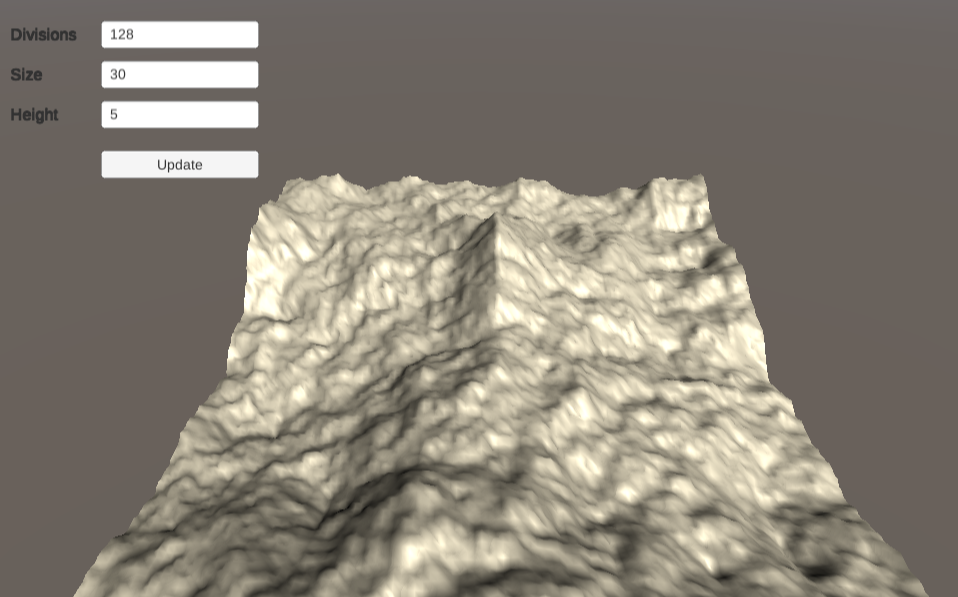

# Unity 2019: Diamon Square Procedural terrain

**Based in:** [Unity Tutorials: Diamond-Square Procedural Terrain](https://www.youtube.com/watch?v=1HV8GbFnCik) tutorial

Renders a procedural terrain using **[Diamond Square](https://en.wikipedia.org/wiki/Diamond-square_algorithm)** common and famous algorithm

## Project scripts

The project contains the scripts below on `Assets/Scripts` folder:

- `MeshGenerator`: This is only to understand the theory about creating mesh with **triangles** and **vertices**.
 
  >**PS:** Attach this script to a any empty gameObject and see the result :)
- `DiamondSquareTerrain`: Generate a diamond square terrain, with **Diamond** and **Square** steps

## Getting Started

1. Download [Unity 2019+](https://store.unity.com/) and open this project

2. Click on **`Play`** button on Unity editor

3. Change the parameters `Divisions`, `Size` and `Height` and click on **Update** button. The terrain will be generated again